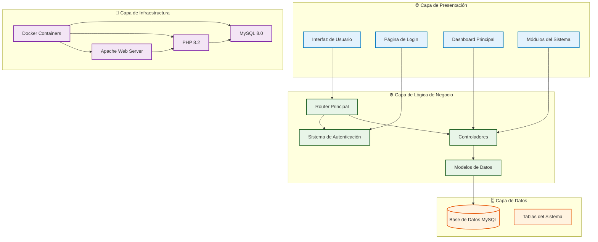
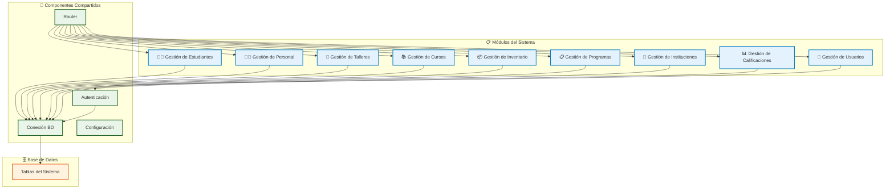
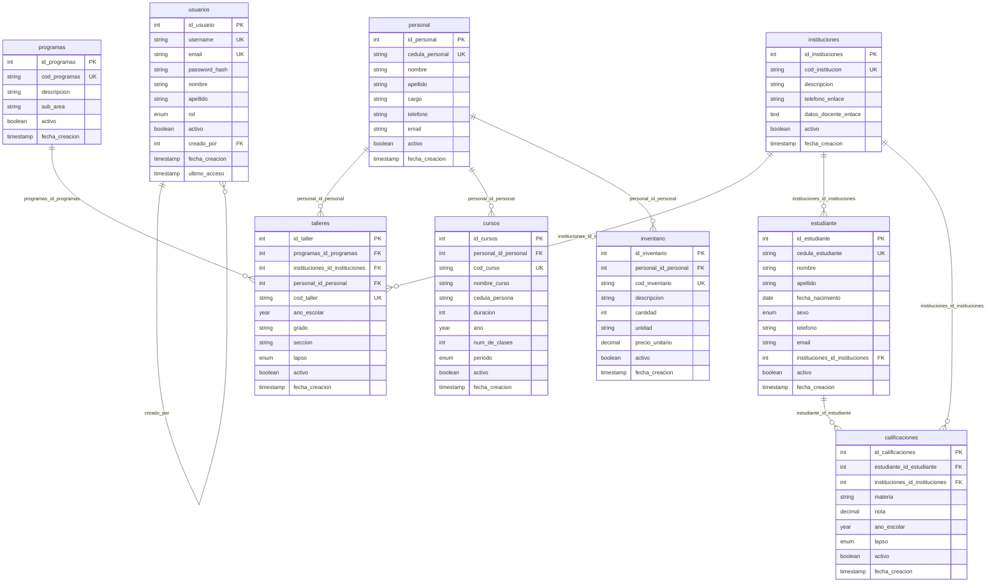
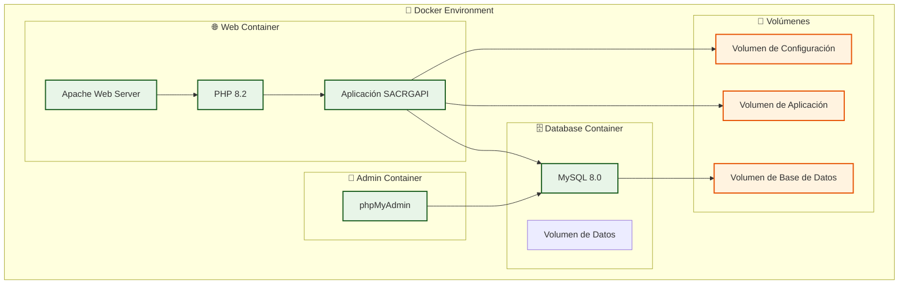
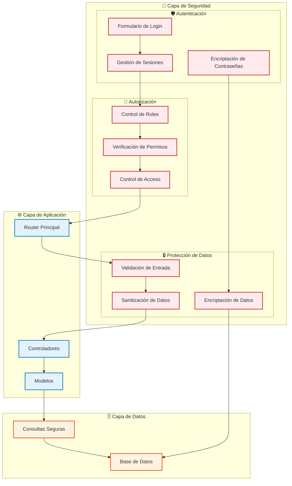
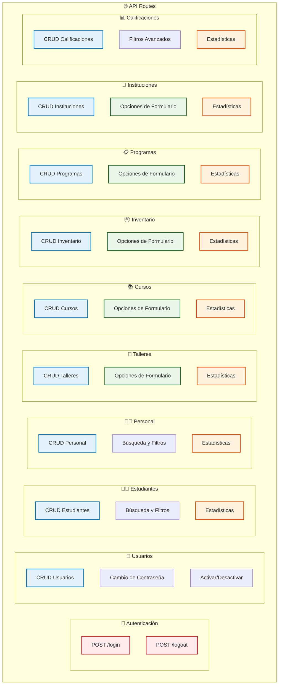
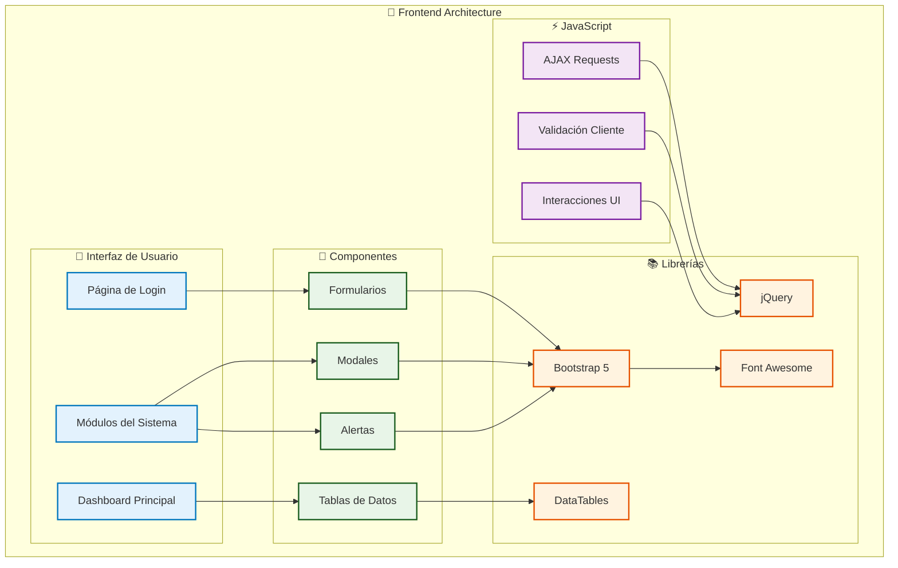
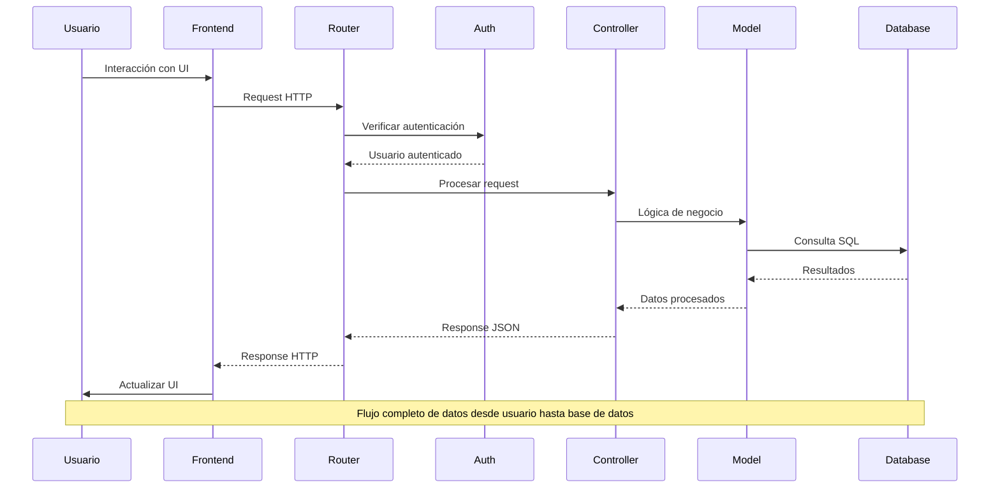

# Diagramas de Arquitectura - Sistema SACRGAPI

## 1. Arquitectura General del Sistema

## 2. Arquitectura de Módulos

## 3. Arquitectura de Base de Datos

## 4. Arquitectura de Contenedores Docker

## 5. Arquitectura de Seguridad

## 6. Arquitectura de API y Rutas

## 7. Arquitectura de Frontend

## 8. Flujo de Datos del Sistema

## Resumen de Arquitectura

### 🏗️ **Arquitectura en Capas**
- **Capa de Presentación**: Interfaz de usuario con Bootstrap 5
- **Capa de Lógica de Negocio**: Controladores y modelos PHP
- **Capa de Datos**: Base de datos MySQL con relaciones normalizadas
- **Capa de Infraestructura**: Contenedores Docker

### 🔧 **Componentes Principales**
- **Router**: Manejo de rutas y enrutamiento
- **Autenticación**: Sistema de login y control de sesiones
- **Modelos**: Lógica de negocio y acceso a datos
- **Vistas**: Interfaz de usuario responsive

### 🗄️ **Base de Datos**
- **MySQL 8.0** con estructura normalizada
- **Relaciones** entre entidades mediante claves foráneas
- **Índices** para optimización de consultas
- **Eliminación lógica** para preservar integridad

### 🐳 **Infraestructura**
- **Docker Compose** para orquestación
- **Apache** como servidor web
- **PHP 8.2** para lógica de aplicación
- **phpMyAdmin** para administración de BD

### 🔐 **Seguridad**
- **Autenticación** con hash de contraseñas
- **Autorización** basada en roles
- **Validación** de entrada de datos
- **Sanitización** de datos para prevenir inyecciones

### 📱 **Frontend**
- **Bootstrap 5** para diseño responsive
- **jQuery** para interacciones
- **DataTables** para tablas dinámicas
- **AJAX** para comunicación asíncrona
