# Diagramas de Casos de Uso - Sistema SACRGAPI

## 1. Diagrama Principal del Sistema

```mermaid
graph TB
    %% Actores
    Admin[👨‍💼 Administrador]
    Supervisor[👨‍💻 Supervisor]
    Operador[👨‍🔧 Operador]
    
    %% Sistema
    SACRGAPI[Sistema SACRGAPI]
    
    %% Casos de uso principales
    UC1[Autenticación y Autorización]
    UC2[Gestión de Usuarios]
    UC3[Gestión de Estudiantes]
    UC4[Gestión de Personal]
    UC5[Gestión de Talleres]
    UC6[Gestión de Cursos]
    UC7[Gestión de Inventario]
    UC8[Gestión de Programas]
    UC9[Gestión de Instituciones]
    UC10[Gestión de Calificaciones]
    UC11[Dashboard y Reportes]
    
    %% Relaciones Admin
    Admin --> UC1
    Admin --> UC2
    Admin --> UC3
    Admin --> UC4
    Admin --> UC5
    Admin --> UC6
    Admin --> UC7
    Admin --> UC8
    Admin --> UC9
    Admin --> UC10
    Admin --> UC11
    
    %% Relaciones Supervisor
    Supervisor --> UC1
    Supervisor --> UC2
    Supervisor --> UC3
    Supervisor --> UC4
    Supervisor --> UC5
    Supervisor --> UC6
    Supervisor --> UC7
    Supervisor --> UC8
    Supervisor --> UC9
    Supervisor --> UC10
    Supervisor --> UC11
    
    %% Relaciones Operador
    Operador --> UC1
    Operador --> UC3
    Operador --> UC4
    Operador --> UC5
    Operador --> UC6
    Operador --> UC7
    Operador --> UC8
    Operador --> UC9
    Operador --> UC10
    Operador --> UC11
    
    %% Relaciones con el sistema
    UC1 --> SACRGAPI
    UC2 --> SACRGAPI
    UC3 --> SACRGAPI
    UC4 --> SACRGAPI
    UC5 --> SACRGAPI
    UC6 --> SACRGAPI
    UC7 --> SACRGAPI
    UC8 --> SACRGAPI
    UC9 --> SACRGAPI
    UC10 --> SACRGAPI
    UC11 --> SACRGAPI
    
    %% Estilos
    classDef actor fill:#e1f5fe,stroke:#01579b,stroke-width:2px
    classDef system fill:#f3e5f5,stroke:#4a148c,stroke-width:2px
    classDef usecase fill:#e8f5e8,stroke:#1b5e20,stroke-width:2px
    
    class Admin,Supervisor,Operador actor
    class SACRGAPI system
    class UC1,UC2,UC3,UC4,UC5,UC6,UC7,UC8,UC9,UC10,UC11 usecase
```

## 2. Diagrama de Autenticación y Autorización

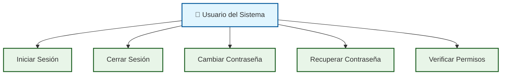

## 3. Diagrama de Gestión de Usuarios

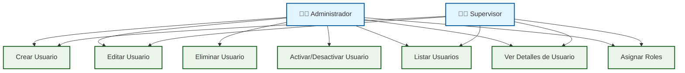

## 4. Diagrama de Gestión de Estudiantes

```mermaid
graph TB
    %% Actores
    Admin[👨‍💼 Administrador]
    Supervisor[👨‍💻 Supervisor]
    Operador[👨‍🔧 Operador]
    
    %% Casos de uso de estudiantes
    UC1[Crear Estudiante]
    UC2[Editar Estudiante]
    UC3[Eliminar Estudiante]
    UC4[Listar Estudiantes]
    UC5[Ver Detalles de Estudiante]
    UC6[Buscar Estudiante]
    UC7[Filtrar por Institución]
    UC8[Ver Calificaciones del Estudiante]
    
    %% Relaciones
    Admin --> UC1
    Admin --> UC2
    Admin --> UC3
    Admin --> UC4
    Admin --> UC5
    Admin --> UC6
    Admin --> UC7
    Admin --> UC8
    
    Supervisor --> UC1
    Supervisor --> UC2
    Supervisor --> UC4
    Supervisor --> UC5
    Supervisor --> UC6
    Supervisor --> UC7
    Supervisor --> UC8
    
    Operador --> UC1
    Operador --> UC2
    Operador --> UC4
    Operador --> UC5
    Operador --> UC6
    Operador --> UC7
    Operador --> UC8
    
    %% Estilos
    classDef actor fill:#e1f5fe,stroke:#01579b,stroke-width:2px
    classDef usecase fill:#e8f5e8,stroke:#1b5e20,stroke-width:2px
    
    class Admin,Supervisor,Operador actor
    class UC1,UC2,UC3,UC4,UC5,UC6,UC7,UC8 usecase
```

## 5. Diagrama de Gestión de Personal

```mermaid
graph TB
    %% Actores
    Admin[👨‍💼 Administrador]
    Supervisor[👨‍💻 Supervisor]
    Operador[👨‍🔧 Operador]
    
    %% Casos de uso de personal
    UC1[Crear Personal]
    UC2[Editar Personal]
    UC3[Eliminar Personal]
    UC4[Listar Personal]
    UC5[Ver Detalles de Personal]
    UC6[Buscar Personal]
    UC7[Asignar a Taller]
    UC8[Asignar a Curso]
    UC9[Ver Talleres del Personal]
    UC10[Ver Cursos del Personal]
    
    %% Relaciones
    Admin --> UC1
    Admin --> UC2
    Admin --> UC3
    Admin --> UC4
    Admin --> UC5
    Admin --> UC6
    Admin --> UC7
    Admin --> UC8
    Admin --> UC9
    Admin --> UC10
    
    Supervisor --> UC1
    Supervisor --> UC2
    Supervisor --> UC4
    Supervisor --> UC5
    Supervisor --> UC6
    Supervisor --> UC7
    Supervisor --> UC8
    Supervisor --> UC9
    Supervisor --> UC10
    
    Operador --> UC1
    Operador --> UC2
    Operador --> UC4
    Operador --> UC5
    Operador --> UC6
    Operador --> UC7
    Operador --> UC8
    Operador --> UC9
    Operador --> UC10
    
    %% Estilos
    classDef actor fill:#e1f5fe,stroke:#01579b,stroke-width:2px
    classDef usecase fill:#e8f5e8,stroke:#1b5e20,stroke-width:2px
    
    class Admin,Supervisor,Operador actor
    class UC1,UC2,UC3,UC4,UC5,UC6,UC7,UC8,UC9,UC10 usecase
```

## 6. Diagrama de Gestión de Talleres

```mermaid
graph TB
    %% Actores
    Admin[👨‍💼 Administrador]
    Supervisor[👨‍💻 Supervisor]
    Operador[👨‍🔧 Operador]
    
    %% Casos de uso de talleres
    UC1[Crear Taller]
    UC2[Editar Taller]
    UC3[Eliminar Taller]
    UC4[Listar Talleres]
    UC5[Ver Detalles de Taller]
    UC6[Buscar Taller]
    UC7[Asignar Programa]
    UC8[Asignar Institución]
    UC9[Asignar Instructor]
    UC10[Filtrar por Año Escolar]
    UC11[Filtrar por Lapso]
    UC12[Ver Estadísticas de Talleres]
    
    %% Relaciones
    Admin --> UC1
    Admin --> UC2
    Admin --> UC3
    Admin --> UC4
    Admin --> UC5
    Admin --> UC6
    Admin --> UC7
    Admin --> UC8
    Admin --> UC9
    Admin --> UC10
    Admin --> UC11
    Admin --> UC12
    
    Supervisor --> UC1
    Supervisor --> UC2
    Supervisor --> UC4
    Supervisor --> UC5
    Supervisor --> UC6
    Supervisor --> UC7
    Supervisor --> UC8
    Supervisor --> UC9
    Supervisor --> UC10
    Supervisor --> UC11
    Supervisor --> UC12
    
    Operador --> UC1
    Operador --> UC2
    Operador --> UC4
    Operador --> UC5
    Operador --> UC6
    Operador --> UC7
    Operador --> UC8
    Operador --> UC9
    Operador --> UC10
    Operador --> UC11
    Operador --> UC12
    
    %% Estilos
    classDef actor fill:#e1f5fe,stroke:#01579b,stroke-width:2px
    classDef usecase fill:#e8f5e8,stroke:#1b5e20,stroke-width:2px
    
    class Admin,Supervisor,Operador actor
    class UC1,UC2,UC3,UC4,UC5,UC6,UC7,UC8,UC9,UC10,UC11,UC12 usecase
```

## 7. Diagrama de Gestión de Cursos

```mermaid
graph TB
    %% Actores
    Admin[👨‍💼 Administrador]
    Supervisor[👨‍💻 Supervisor]
    Operador[👨‍🔧 Operador]
    
    %% Casos de uso de cursos
    UC1[Crear Curso]
    UC2[Editar Curso]
    UC3[Eliminar Curso]
    UC4[Listar Cursos]
    UC5[Ver Detalles de Curso]
    UC6[Buscar Curso]
    UC7[Asignar Instructor]
    UC8[Gestionar Participantes]
    UC9[Gestionar Notas]
    UC10[Filtrar por Año]
    UC11[Filtrar por Periodo]
    UC12[Ver Estadísticas de Cursos]
    
    %% Relaciones
    Admin --> UC1
    Admin --> UC2
    Admin --> UC3
    Admin --> UC4
    Admin --> UC5
    Admin --> UC6
    Admin --> UC7
    Admin --> UC8
    Admin --> UC9
    Admin --> UC10
    Admin --> UC11
    Admin --> UC12
    
    Supervisor --> UC1
    Supervisor --> UC2
    Supervisor --> UC4
    Supervisor --> UC5
    Supervisor --> UC6
    Supervisor --> UC7
    Supervisor --> UC8
    Supervisor --> UC9
    Supervisor --> UC10
    Supervisor --> UC11
    Supervisor --> UC12
    
    Operador --> UC1
    Operador --> UC2
    Operador --> UC4
    Operador --> UC5
    Operador --> UC6
    Operador --> UC7
    Operador --> UC8
    Operador --> UC9
    Operador --> UC10
    Operador --> UC11
    Operador --> UC12
    
    %% Estilos
    classDef actor fill:#e1f5fe,stroke:#01579b,stroke-width:2px
    classDef usecase fill:#e8f5e8,stroke:#1b5e20,stroke-width:2px
    
    class Admin,Supervisor,Operador actor
    class UC1,UC2,UC3,UC4,UC5,UC6,UC7,UC8,UC9,UC10,UC11,UC12 usecase
```

## 8. Diagrama de Gestión de Inventario

```mermaid
graph TB
    %% Actores
    Admin[👨‍💼 Administrador]
    Supervisor[👨‍💻 Supervisor]
    Operador[👨‍🔧 Operador]
    
    %% Casos de uso de inventario
    UC1[Crear Item de Inventario]
    UC2[Editar Item de Inventario]
    UC3[Eliminar Item de Inventario]
    UC4[Listar Inventario]
    UC5[Ver Detalles de Item]
    UC6[Buscar Item]
    UC7[Asignar a Taller]
    UC8[Asignar a Personal]
    UC9[Actualizar Stock]
    UC10[Filtrar por Taller]
    UC11[Filtrar por Personal]
    UC12[Ver Estadísticas de Inventario]
    
    %% Relaciones
    Admin --> UC1
    Admin --> UC2
    Admin --> UC3
    Admin --> UC4
    Admin --> UC5
    Admin --> UC6
    Admin --> UC7
    Admin --> UC8
    Admin --> UC9
    Admin --> UC10
    Admin --> UC11
    Admin --> UC12
    
    Supervisor --> UC1
    Supervisor --> UC2
    Supervisor --> UC4
    Supervisor --> UC5
    Supervisor --> UC6
    Supervisor --> UC7
    Supervisor --> UC8
    Supervisor --> UC9
    Supervisor --> UC10
    Supervisor --> UC11
    Supervisor --> UC12
    
    Operador --> UC1
    Operador --> UC2
    Operador --> UC4
    Operador --> UC5
    Operador --> UC6
    Operador --> UC7
    Operador --> UC8
    Operador --> UC9
    Operador --> UC10
    Operador --> UC11
    Operador --> UC12
    
    %% Estilos
    classDef actor fill:#e1f5fe,stroke:#01579b,stroke-width:2px
    classDef usecase fill:#e8f5e8,stroke:#1b5e20,stroke-width:2px
    
    class Admin,Supervisor,Operador actor
    class UC1,UC2,UC3,UC4,UC5,UC6,UC7,UC8,UC9,UC10,UC11,UC12 usecase
```

## 9. Diagrama de Gestión de Programas

```mermaid
graph TB
    %% Actores
    Admin[👨‍💼 Administrador]
    Supervisor[👨‍💻 Supervisor]
    Operador[👨‍🔧 Operador]
    
    %% Casos de uso de programas
    UC1[Crear Programa]
    UC2[Editar Programa]
    UC3[Eliminar Programa]
    UC4[Listar Programas]
    UC5[Ver Detalles de Programa]
    UC6[Buscar Programa]
    UC7[Asignar Sub-área]
    UC8[Activar/Desactivar Programa]
    UC9[Ver Talleres del Programa]
    UC10[Ver Estadísticas de Programas]
    
    %% Relaciones
    Admin --> UC1
    Admin --> UC2
    Admin --> UC3
    Admin --> UC4
    Admin --> UC5
    Admin --> UC6
    Admin --> UC7
    Admin --> UC8
    Admin --> UC9
    Admin --> UC10
    
    Supervisor --> UC1
    Supervisor --> UC2
    Supervisor --> UC4
    Supervisor --> UC5
    Supervisor --> UC6
    Supervisor --> UC7
    Supervisor --> UC8
    Supervisor --> UC9
    Supervisor --> UC10
    
    Operador --> UC1
    Operador --> UC2
    Operador --> UC4
    Operador --> UC5
    Operador --> UC6
    Operador --> UC7
    Operador --> UC8
    Operador --> UC9
    Operador --> UC10
    
    %% Estilos
    classDef actor fill:#e1f5fe,stroke:#01579b,stroke-width:2px
    classDef usecase fill:#e8f5e8,stroke:#1b5e20,stroke-width:2px
    
    class Admin,Supervisor,Operador actor
    class UC1,UC2,UC3,UC4,UC5,UC6,UC7,UC8,UC9,UC10 usecase
```

## 10. Diagrama de Gestión de Instituciones

```mermaid
graph TB
    %% Actores
    Admin[👨‍💼 Administrador]
    Supervisor[👨‍💻 Supervisor]
    Operador[👨‍🔧 Operador]
    
    %% Casos de uso de instituciones
    UC1[Crear Institución]
    UC2[Editar Institución]
    UC3[Eliminar Institución]
    UC4[Listar Instituciones]
    UC5[Ver Detalles de Institución]
    UC6[Buscar Institución]
    UC7[Gestionar Datos de Enlace]
    UC8[Activar/Desactivar Institución]
    UC9[Ver Estudiantes de la Institución]
    UC10[Ver Talleres de la Institución]
    UC11[Ver Estadísticas de Instituciones]
    
    %% Relaciones
    Admin --> UC1
    Admin --> UC2
    Admin --> UC3
    Admin --> UC4
    Admin --> UC5
    Admin --> UC6
    Admin --> UC7
    Admin --> UC8
    Admin --> UC9
    Admin --> UC10
    Admin --> UC11
    
    Supervisor --> UC1
    Supervisor --> UC2
    Supervisor --> UC4
    Supervisor --> UC5
    Supervisor --> UC6
    Supervisor --> UC7
    Supervisor --> UC8
    Supervisor --> UC9
    Supervisor --> UC10
    Supervisor --> UC11
    
    Operador --> UC1
    Operador --> UC2
    Operador --> UC4
    Operador --> UC5
    Operador --> UC6
    Operador --> UC7
    Operador --> UC8
    Operador --> UC9
    Operador --> UC10
    Operador --> UC11
    
    %% Estilos
    classDef actor fill:#e1f5fe,stroke:#01579b,stroke-width:2px
    classDef usecase fill:#e8f5e8,stroke:#1b5e20,stroke-width:2px
    
    class Admin,Supervisor,Operador actor
    class UC1,UC2,UC3,UC4,UC5,UC6,UC7,UC8,UC9,UC10,UC11 usecase
```

## 11. Diagrama de Gestión de Calificaciones

```mermaid
graph TB
    %% Actores
    Admin[👨‍💼 Administrador]
    Supervisor[👨‍💻 Supervisor]
    Operador[👨‍🔧 Operador]
    
    %% Casos de uso de calificaciones
    UC1[Crear Calificación]
    UC2[Editar Calificación]
    UC3[Eliminar Calificación]
    UC4[Listar Calificaciones]
    UC5[Ver Detalles de Calificación]
    UC6[Buscar Calificación]
    UC7[Filtrar por Estudiante]
    UC8[Filtrar por Institución]
    UC9[Filtrar por Año Escolar]
    UC10[Filtrar por Lapso]
    UC11[Ver Promedio del Estudiante]
    UC12[Ver Estadísticas de Calificaciones]
    
    %% Relaciones
    Admin --> UC1
    Admin --> UC2
    Admin --> UC3
    Admin --> UC4
    Admin --> UC5
    Admin --> UC6
    Admin --> UC7
    Admin --> UC8
    Admin --> UC9
    Admin --> UC10
    Admin --> UC11
    Admin --> UC12
    
    Supervisor --> UC1
    Supervisor --> UC2
    Supervisor --> UC4
    Supervisor --> UC5
    Supervisor --> UC6
    Supervisor --> UC7
    Supervisor --> UC8
    Supervisor --> UC9
    Supervisor --> UC10
    Supervisor --> UC11
    Supervisor --> UC12
    
    Operador --> UC1
    Operador --> UC2
    Operador --> UC4
    Operador --> UC5
    Operador --> UC6
    Operador --> UC7
    Operador --> UC8
    Operador --> UC9
    Operador --> UC10
    Operador --> UC11
    Operador --> UC12
    
    %% Estilos
    classDef actor fill:#e1f5fe,stroke:#01579b,stroke-width:2px
    classDef usecase fill:#e8f5e8,stroke:#1b5e20,stroke-width:2px
    
    class Admin,Supervisor,Operador actor
    class UC1,UC2,UC3,UC4,UC5,UC6,UC7,UC8,UC9,UC10,UC11,UC12 usecase
```

## 12. Diagrama de Dashboard y Reportes

```mermaid
graph TB
    %% Actores
    Admin[👨‍💼 Administrador]
    Supervisor[👨‍💻 Supervisor]
    Operador[👨‍🔧 Operador]
    
    %% Casos de uso de dashboard
    UC1[Ver Dashboard Principal]
    UC2[Ver Estadísticas Generales]
    UC3[Ver Reportes de Estudiantes]
    UC4[Ver Reportes de Personal]
    UC5[Ver Reportes de Talleres]
    UC6[Ver Reportes de Cursos]
    UC7[Ver Reportes de Inventario]
    UC8[Ver Reportes de Calificaciones]
    UC9[Exportar Reportes]
    UC10[Filtrar Reportes por Fecha]
    UC11[Ver Gráficos y Estadísticas]
    
    %% Relaciones
    Admin --> UC1
    Admin --> UC2
    Admin --> UC3
    Admin --> UC4
    Admin --> UC5
    Admin --> UC6
    Admin --> UC7
    Admin --> UC8
    Admin --> UC9
    Admin --> UC10
    Admin --> UC11
    
    Supervisor --> UC1
    Supervisor --> UC2
    Supervisor --> UC3
    Supervisor --> UC4
    Supervisor --> UC5
    Supervisor --> UC6
    Supervisor --> UC7
    Supervisor --> UC8
    Supervisor --> UC9
    Supervisor --> UC10
    Supervisor --> UC11
    
    Operador --> UC1
    Operador --> UC2
    Operador --> UC3
    Operador --> UC4
    Operador --> UC5
    Operador --> UC6
    Operador --> UC7
    Operador --> UC8
    Operador --> UC11
    
    %% Estilos
    classDef actor fill:#e1f5fe,stroke:#01579b,stroke-width:2px
    classDef usecase fill:#e8f5e8,stroke:#1b5e20,stroke-width:2px
    
    class Admin,Supervisor,Operador actor
    class UC1,UC2,UC3,UC4,UC5,UC6,UC7,UC8,UC9,UC10,UC11 usecase
```

## 13. Diagrama de Relaciones entre Módulos

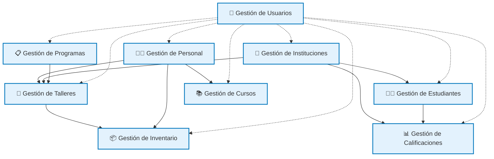

## Resumen de Actores y Permisos

### 👨‍💼 Administrador
- **Acceso completo** a todos los módulos
- **Gestión de usuarios** (crear, editar, eliminar, activar/desactivar)
- **Configuración del sistema**
- **Todos los permisos** de Supervisor y Operador

### 👨‍💻 Supervisor
- **Gestión de usuarios** (excepto otros administradores)
- **Acceso a todos los módulos** operativos
- **Reportes y estadísticas**
- **Todos los permisos** de Operador

### 👨‍🔧 Operador
- **Acceso a módulos operativos** (estudiantes, personal, talleres, cursos, inventario, programas, instituciones, calificaciones)
- **Gestión de datos** (CRUD completo)
- **Sin acceso** a gestión de usuarios
- **Acceso limitado** a reportes

## Funcionalidades Principales por Módulo

### 🔐 Autenticación y Autorización
- Iniciar sesión
- Cerrar sesión
- Cambiar contraseña
- Verificar permisos por rol

### 👥 Gestión de Usuarios
- CRUD completo de usuarios
- Asignación de roles
- Activación/desactivación
- Control de acceso

### 👨‍🎓 Gestión de Estudiantes
- CRUD completo de estudiantes
- Relación con instituciones
- Filtros y búsquedas
- Integración con calificaciones

### 👨‍🏫 Gestión de Personal
- CRUD completo de personal
- Asignación a talleres y cursos
- Gestión de inventario
- Relaciones con otros módulos

### 🔧 Gestión de Talleres
- CRUD completo de talleres
- Relación con programas, instituciones e instructores
- Filtros por año escolar y lapso
- Estadísticas y reportes

### 📚 Gestión de Cursos
- CRUD completo de cursos
- Asignación de instructores
- Gestión de participantes y notas
- Filtros por año y periodo

### 📦 Gestión de Inventario
- CRUD completo de inventario
- Relación con talleres y personal
- Control de stock
- Filtros y búsquedas

### 📋 Gestión de Programas
- CRUD completo de programas
- Asignación de sub-áreas
- Relación con talleres
- Estadísticas

### 🏫 Gestión de Instituciones
- CRUD completo de instituciones
- Gestión de datos de enlace
- Relación con estudiantes y talleres
- Estadísticas

### 📊 Gestión de Calificaciones
- CRUD completo de calificaciones
- Filtros por estudiante e institución
- Cálculo de promedios
- Reportes y estadísticas

### 📈 Dashboard y Reportes
- Vista general del sistema
- Estadísticas por módulo
- Gráficos y visualizaciones
- Exportación de reportes
