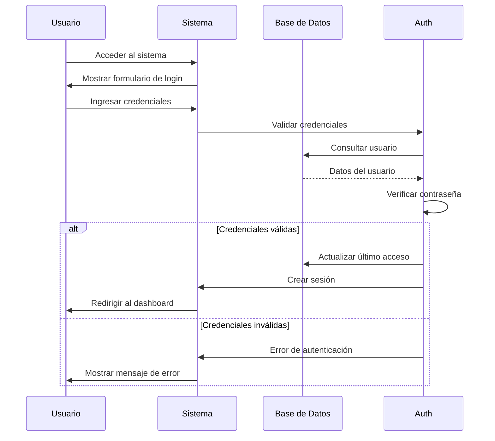
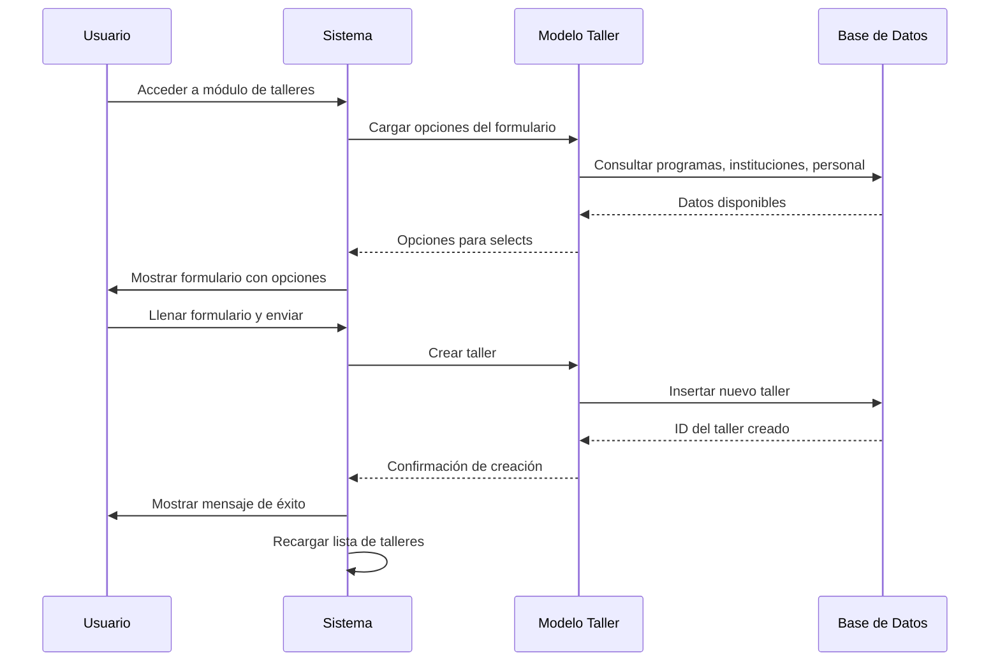
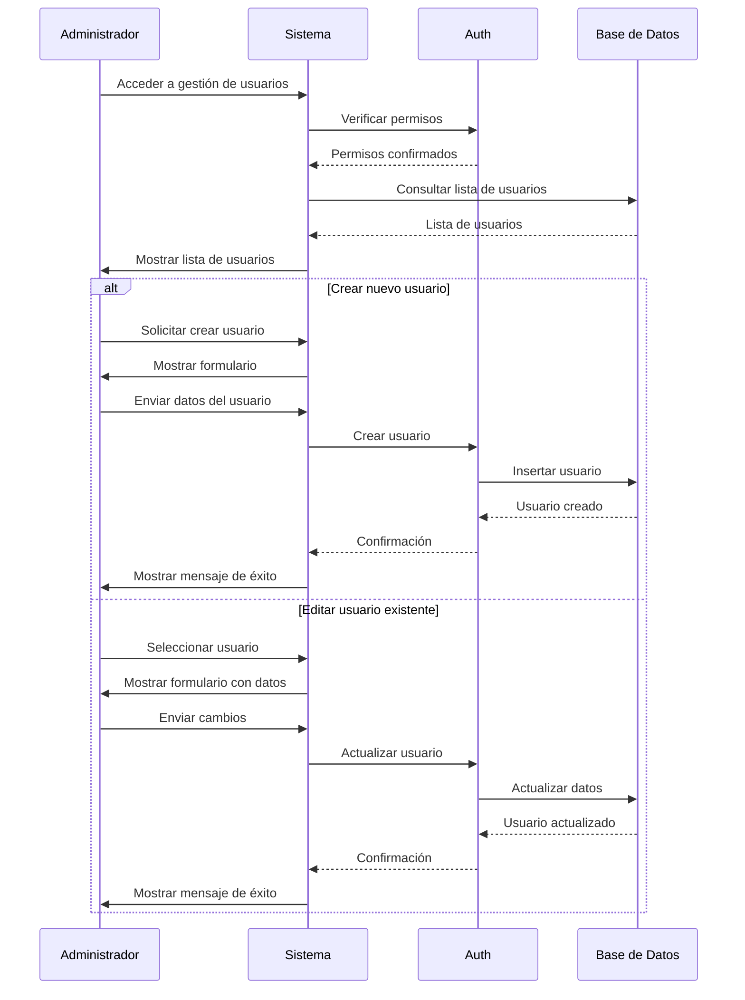
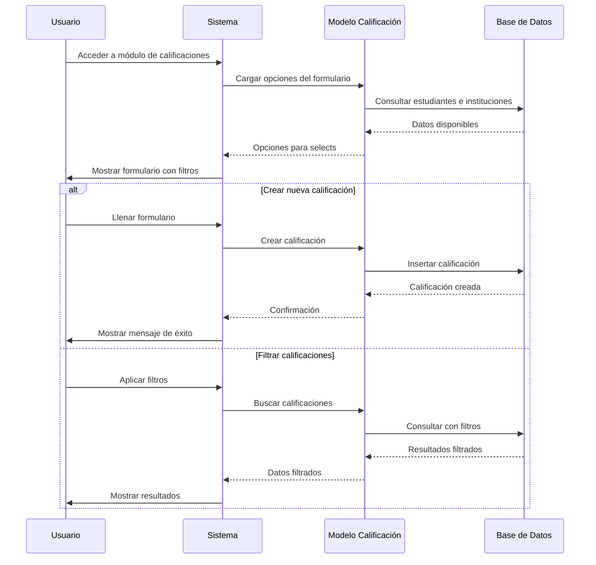
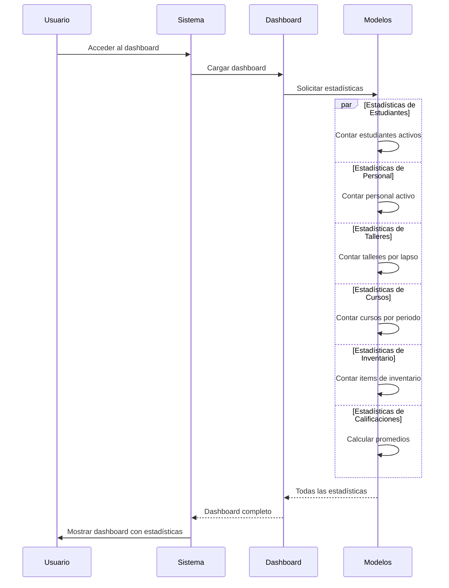
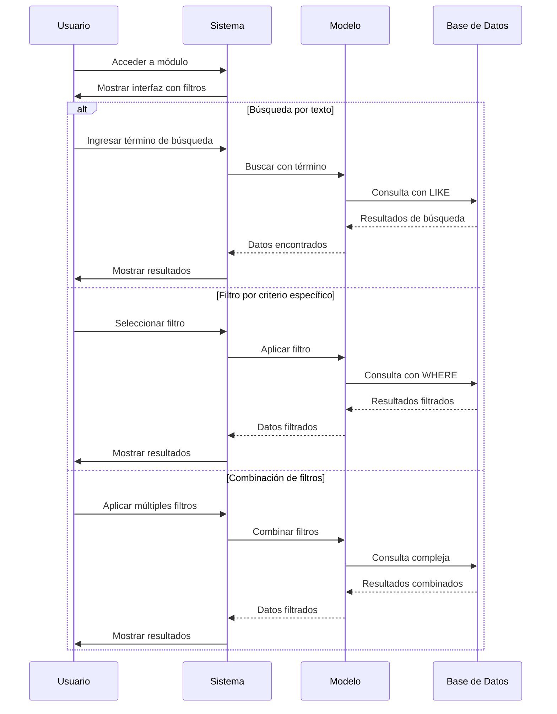
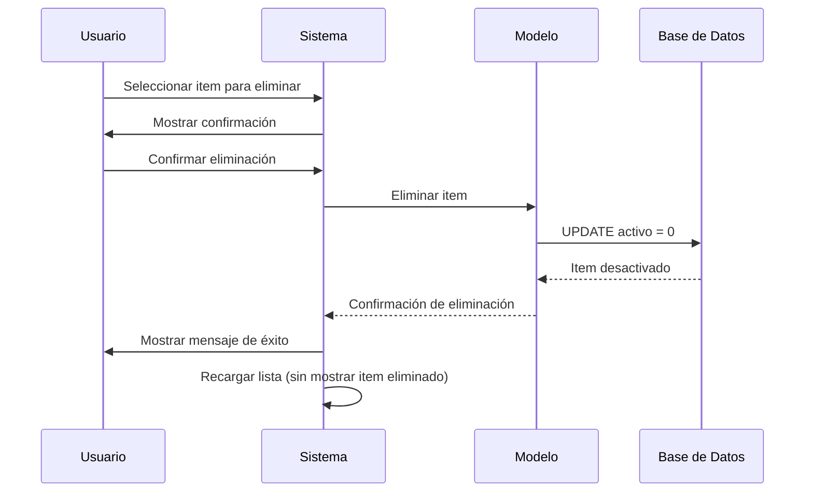
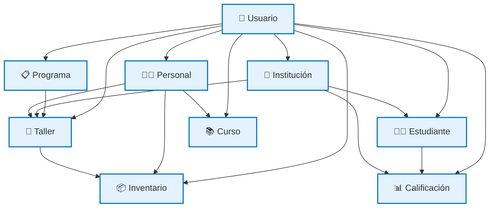
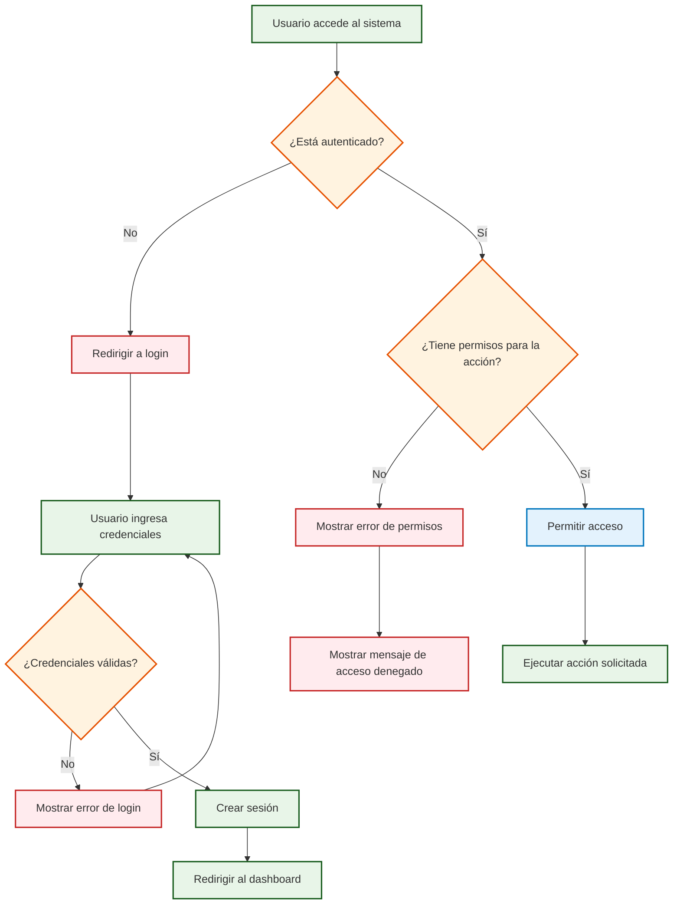
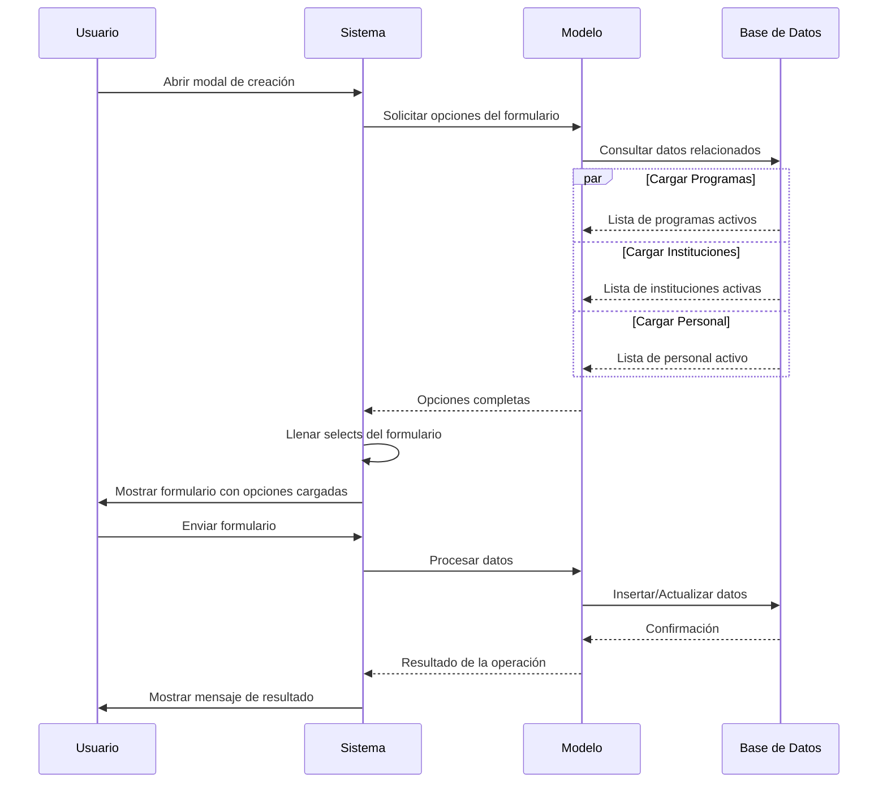

# Diagramas de Flujo de Trabajo - Sistema SACRGAPI

## 1. Flujo de Autenticación

## 2. Flujo de Creación de Taller

## 3. Flujo de Gestión de Usuarios

## 4. Flujo de Gestión de Calificaciones

## 5. Flujo de Dashboard y Reportes

## 6. Flujo de Búsqueda y Filtros

## 7. Flujo de Eliminación Lógica

## 8. Flujo de Relaciones entre Módulos

## 9. Flujo de Validación de Permisos

## 10. Flujo de Carga de Opciones para Formularios

## Resumen de Flujos Principales

### 🔐 Autenticación
1. Usuario accede al sistema
2. Sistema valida credenciales
3. Se crea sesión si es válido
4. Se redirige al dashboard

### 📝 CRUD Operations
1. Usuario accede al módulo
2. Sistema carga opciones del formulario
3. Usuario llena y envía formulario
4. Sistema valida y procesa datos
5. Se actualiza la base de datos
6. Se muestra confirmación

### 🔍 Búsqueda y Filtros
1. Usuario aplica filtros
2. Sistema construye consulta
3. Base de datos ejecuta consulta
4. Resultados se muestran al usuario

### 📊 Dashboard y Reportes
1. Usuario accede al dashboard
2. Sistema solicita estadísticas de todos los módulos
3. Se ejecutan consultas en paralelo
4. Se consolidan los resultados
5. Se muestra dashboard completo

### 🔗 Relaciones entre Módulos
- Los módulos están interconectados a través de claves foráneas
- Las opciones de formularios se cargan dinámicamente
- Los filtros permiten navegar entre entidades relacionadas
- Las estadísticas se calculan considerando todas las relaciones
